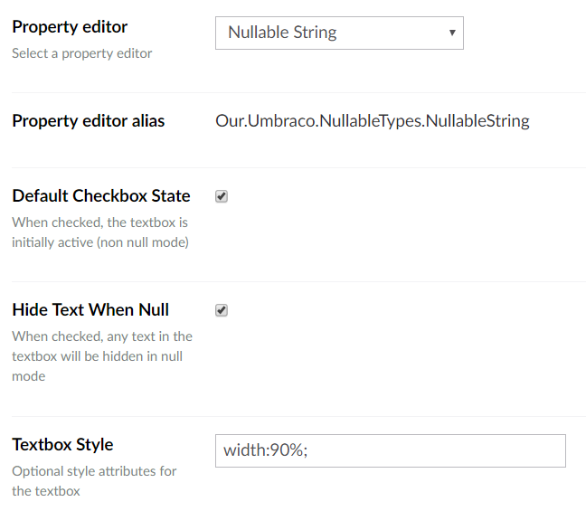

# Umbraco Nullable Types
Property editors which enable a null value to be selected in preference to a default value.

[The NuGet package](https://www.nuget.org/packages/Our.Umbraco.NullableTypes) installs a single assembly _Our.Umbraco.NullableTypes.dll_ which has a dependency on [Umbraco Embedded Resource](https://github.com/Hendy/umbraco-embedded-resource).

## _Nullable Boolean_
A tri-state data-type where the default value is null.

The raw values are stored as strings: "", "0" or "1", which makes it compatable with the built-in true/false data-type.
The property-value-converter will return a nullable bool.

### Property Editor

    
### Property Editor Configuration

## _Nullable Integer_
Based on the built-in numeric data-type, this adds a checkbox to toggle between the integer value and a null.
The property-value-converter will return a nullable integer.

### Property Editor

    
### Property Editor Configuration

## _Nullable String_
'But strings are always nullable !' however with a textbox alone there's no way to distinguish between whitespace and null, 
so this data-type adds a checkbox to toggle between the textbox value and a null.

The raw values are stored as json, but will also read in raw string values (as stored by the built-in textstring data-type, so can migrate away from this, but not return if item has been saved).
The property-value-converter will return a string.

### Property Editor

    
### Property Editor Configuration

